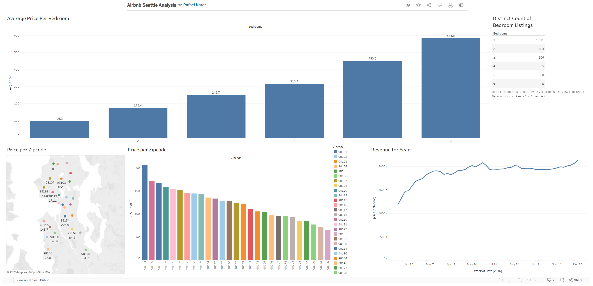

Airbnb Market Analysis — Seattle (2016)
===============================

Overview
---------

Tableau dashboard analyzing 2016 Seattle Airbnb pricing: bedroom count vs. price, ZIP-level variation, and weekly revenue trend.

Live demo:
---------

`View on Tableau Public <https://public.tableau.com/views/AirbnbSeattleAnalysis_17124051353650/Dashboard1?:language=en-US&:sid=&:redirect=auth&:display_count=n&:origin=viz_share_link>`_

Screenshot
----------

   Dashboard overview.

Notes
-----

- Workbook (`.twbx`) intentionally omitted.
- Dataset not included; this repo serves as a portfolio preview via screenshot + live link.

License
-------

This project is licensed under the MIT License - see the `LICENSE <LICENSE>`_ file for details.
